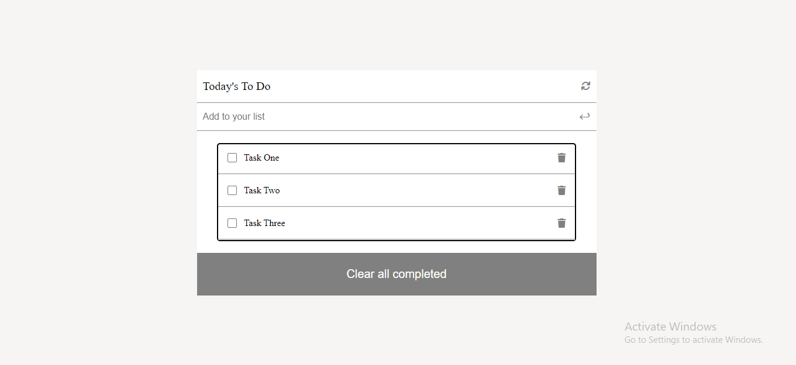

# To-Do-List


This is a pair programming project that allows users to add and remove books from a list using javascript objects and arrays

The goal of the project is to build the application using Vanilla JavaScript and ES6 Modules.. click [here] (https://kaitcham.github.io/To-Do-List/) to see deployed live version



## Features implemented so far
- Add task
- Remove task
- Saving current state of tasklist to local storage

## Built With

- HTML5, Javascript
- CSS3
- Linters

To get a local copy up and running follow these simple example steps.

### Prerequisites
- Have a good knowledge on javascript objects
- Have VSCode or other text editor installed. [Link to download VSCode](https://code.visualstudio.com/download)
- Install node package. [Link to download node](https://nodejs.org/en/download/)
- Have git installed.[Link to download git](https://git-scm.com/downloads)
- Create a github repository.

# Getting Started

#### Cloning the project

```
git clone  <git@github.com:kaitcham/To-Do-List.git>
```

## Getting started with Webpack

```
npm install webpack webpack-cli --save-dev
```

## Getting packages and debuging with Stylelint

```
npm install --save-dev stylelint@13.x stylelint-scss@3.x stylelint-config-standard@21.x stylelint-csstree-validator@1.x
```

##### For validation detection using Stylelint Run

```
npx stylelint "**/*.{css,scss}"
```

##### from parent source directory

## Getting packages and debuging with ESlint

```
npm install npm install --save-dev eslint@7.x eslint-config-airbnb-base@14.x eslint-plugin-import@2.x babel-eslint@10.x
```

##### For validation detection using Stylelint Run

```
npx eslint .
```

##### from parent source directory

## Getting packages and debuging with Webhint

```
npm init -y
npm install --save-dev hint@6.x
```

##### For validation detection using Webhint, Run

```
npx hint .
```

##### To Compile and See a live Version,  Run
```
npm run build
```
```
npm start
```


## Authors

👤 **Kait Cham**

- GitHub: [@githubhandle](https://github.com/kaitcham)